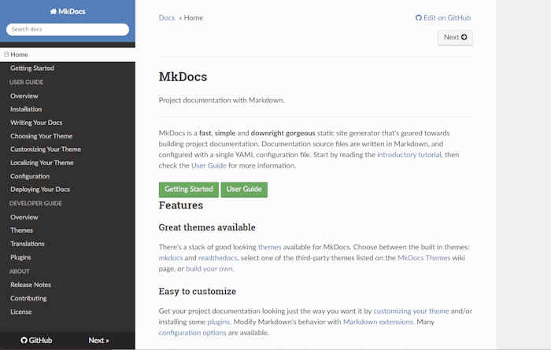

# 使用MkDocs入门
一个入门教程！

---

## 安装

在命令行中运行以下命令安装MkDocs：

```bash
pip install mkdocs
```

有关更多详细信息，请参见[安装指南]。

## 创建新项目

入门非常容易。要创建新项目，请在命令行中运行以下命令：

```bash
mkdocs new my-project
cd my-project
```

花点时间来检查一下已经为您创建的初始项目。


有一个名为`mkdocs.yml`的单个配置文件，以及一个名为`docs`的文件夹，其中包含您的文档源文件（`docs`是[docs_dir]配置设置的默认值）。现在，`docs`文件夹仅包含一个名为`index.md`的单个文档页面。

MkDocs带有一个内置的dev服务器，可以让您在编写文档时预览文档。确保您位于与`mkdocs.yml`配置文件相同的目录中，然后通过运行`mkdocs serve`命令启动服务器：

```console
$ mkdocs serve
INFO    -  Building documentation...
INFO    -  Cleaning site directory
INFO    -  Documentation built in 0.22 seconds
INFO    -  [15:50:43] Watching paths for changes: 'docs', 'mkdocs.yml'
INFO    -  [15:50:43] Serving on http://127.0.0.1:8000/
```

在您的浏览器中打开<http://127.0.0.1:8000/>，您将看到显示默认主页：


Dev服务器还支持自动重新加载，并且每当配置文件、文档目录或主题目录中的任何内容更改时都会重建您的文档。

在您选择的文本编辑器中打开`docs/index.md`文档，将初始标题更改为`MkLorum`，然后保存更改。您的浏览器将自动重新加载，您应该立即看到已更新的文档。

现在尝试编辑配置文件`mkdocs.yml`。将[`site_name`][site_name]设置更改为`MkLorum`并保存文件。

```yaml
site_name: MkLorum
site_url: https://example.com/
```

您的浏览器应该立即重新加载，您将看到新的站点名称生效。


注意:
[`site_name`][site_name]和[`site_url`][site_url]配置选项是您配置文件中唯一需要的两个必需选项。创建新项目时，`site_url`选项被分配占位符值：`https://example.com`。如果最终位置已知，则现在可以更改该设置以指向它。或者您可以选择暂时不更改它。只是确保在将网站部署到生产服务器上之前进行编辑。

## 添加页面

现在将第二张页面添加到您的文档：

```bash
curl 'https://jaspervdj.be/lorem-markdownum/markdown.txt' > docs/about.md
```

由于我们的文档站点将包括一些导航标题，因此您可能希望编辑配置文件，并通过添加[`nav`][nav]设置来添加关于导航标题中每个页面的顺序、标题和嵌套的一些信息：

```yaml
site_name: MkLorum
site_url: https://example.com/
nav:
  - Home: index.md
  - About: about.md
```

保存更改，您现在将在左侧看到导航栏，并包含`Home`和`About`选项，以及右侧的`Search`、`Previous`和`Next`选项。


尝试菜单项并在页面之间前后导航。然后单击`Search`。将显示搜索对话框，允许您搜索任何页面上的任何文本。请注意，搜索结果包括站点上搜索项的每个出现，并直接链接到出现搜索项的页面的部分。您可以在任何情况下轻松获得所有这些内容，无需进行任何配置！


## 主题我们的文档

现在通过更改主题更改配置文件以更改文档的显示方式。编辑`mkdocs.yml`文件并添加[`theme`][theme]设置：

```yaml
site_name: MkLorum
site_url: https://example.com/
nav:
  - Home: index.md
  - About: about.md
theme: readthedocs
```

保存更改，您将看到正在使用ReadTheDocs主题。



## 更改Favicon Icon

默认情况下，MkDocs使用[MkDocs favicon]图标。要使用其他图标，请在`docs`目录中创建`img`子目录，然后将自定义的`favicon.ico`文件复制到该目录中。MkDocs将自动检测并使用该文件作为您的Favicon图标。

[MkDocs favicon]: img/favicon.ico

## 构建网站

看起来不错。您已准备好部署第一次通过您的`MkLorum`文档。首先构建文档：

```bash
mkdocs build
```

这将创建一个名为`site`的新目录。查看目录的内容：

```console
$ ls site
about  fonts  index.html  license  search.html
css    img    js          mkdocs   sitemap.xml
```

请注意，您的源文档已输出为两个名为`index.html`和`about/index.html`的HTML文件。在文档主题的一部分中，还有各种其他媒体。您甚至有一个`sitemap.xml`文件和`mkdocs/search_index.json`。

如果您正在使用诸如“git”之类的源代码控制，则可能不希望将文档生成添加到存储库中。将包含`site/`的行添加到您的`.gitignore`文件中。

```bash
echo "site/" >> .gitignore
```

如果您正在使用其他源代码控制工具，则需要检查其文档以查看如何忽略特定目录。

## 其他命令和选项

有各种其他命令和选项可用。有关所有命令的完整列表，请使用“--help”标志：

```bash
mkdocs --help
```

要查看给定命令上可用选项的列表，请使用带有该命令的“--help”标志。例如，要获取`build`命令的所有可用选项的列表，请运行以下命令：

```bash
mkdocs build --help
```

## 部署

您刚刚构建的文档站点仅使用静态文件，因此几乎可以从任何地方托管它。只需将整个`site`目录的内容上传到托管网站的任何位置，您就完成了。有关一些常见主机的特定说明，请参见[部署您的文档][deploy]页面。

## 获取帮助 

有关MkDocs所有功能的完整文档，请参见[用户指南]。

要获取有关MkDocs的帮助，请使用[GitHub discussions]或[GitHub issues]。

[安装指南]: user-guide/installation.md
[docs_dir]: user-guide/configuration.md#docs_dir
[deploy]: user-guide/deploying-your-docs.md
[nav]: user-guide/configuration.md#nav
[GitHub discussions]: https://github.com/mkdocs/mkdocs/discussions
[GitHub issues]: https://github.com/mkdocs/mkdocs/issues
[site_name]: user-guide/configuration.md#site_name
[site_url]: user-guide/configuration.md#site_url
[theme]: user-guide/configuration.md#theme
[用户指南]: user-guide/README.md