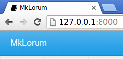

# MkDocs的入门

一份入门教程！

---

## 安装

在命令行中运行以下命令来安装MkDocs：

```bash
pip install mkdocs
```

有关更多详情，请参见[安装指南]。

## 创建新项目

入门非常容易。要创建新项目，请在命令行中运行以下命令：

```bash
mkdocs new my-project
cd my-project
```

请花点时间查看为您创建的初始项目。


有一个名为 `mkdocs.yml` 的单个配置文件，以及一个名为 `docs` 的文件夹，其中包含您的文档源文件（`docs` 是 [docs_dir] 配置设置的默认值）。现在，`docs`文件夹只包含一个名为 `index.md` 的文档页面。

MkDocs带有内置的开发服务器，可以让您在工作时预览文档。确保您在与 `mkdocs.yml` 配置文件相同的目录中，然后通过运行 `mkdocs serve` 命令来启动服务器：

```console
$ mkdocs serve
INFO    -  Building documentation...
INFO    -  Cleaning site directory
INFO    -  Documentation built in 0.22 seconds
INFO    -  [15:50:43] Watching paths for changes: 'docs', 'mkdocs.yml'
INFO    -  [15:50:43] Serving on http://127.0.0.1:8000/
```

在浏览器中打开 <http://127.0.0.1:8000/> ，您将看到显示默认主页：


dev-server 还支持自动重载，并且每当配置文件、文档目录或主题目录中的任何内容更改时，它都会重新构建您的文档。

在您选择的文本编辑器中打开 `docs/index.md` 文档，将初始标题更改为 `MkLorum` 并保存更改。您的浏览器将自动重新加载，并应立即看到更新的文档。

现在尝试编辑配置文件：`mkdocs.yml`。更改 [`site_name`] [site_name] 设置为 `MkLorum` 并保存文件。

```yaml
site_name: MkLorum
site_url: https://example.com/
```

您的浏览器应立即重新加载，您将看到您的新站点名称生效。



注意：
[`site_name`] [site_name] 和 [`site_url`] [site_url] 配置选项是配置文件中仅需的两个选项。在创建新项目时，` site_url` 选项被指定占位符值：`https://example.com`。如果已知最终位置，可以将该设置更改为指向该位置。或者，您可以选择将其保持不变。只需在将站点部署到生产服务器之前编辑它即可。

## 添加页面

现在向您的文档添加第二个页面：

```bash
curl 'https://jaspervdj.be/lorem-markdownum/markdown.txt' > docs/about.md
```

由于我们的文档站点将包含一些导航标题，因此您可能希望编辑配置文件并添加一些有关导航标头中每个页面的顺序、标题和嵌套的信息，方法是添加 [`nav`][nav] 设置：

```yaml
site_name: MkLorum
site_url: https://example.com/
nav:
  - 首页：index.md
  - 关于：about.md
```

保存更改，您现在将看到在左侧有`首页`和 `关于` 项目的导航栏以及右侧的`搜索`、`上一页`和`下一页`项目。


尝试菜单项并在页面之间前后导航。然后单击`查找`。将出现搜索对话框，允许您在任何页面上搜索任何文本。请注意，搜索结果包括站点上搜索词的每个实例，并直接链接到搜索词出现的页面的部分。您无需花费任何工作或配置就可以获得所有这些！


## 主题文档

现在通过更改主题来更改文档的显示方式。编辑 `mkdocs.yml` 文件并添加一个 [`theme`] [theme] 设置：

```yaml
site_name: MkLorum
site_url: https://example.com/
nav:
  - 首页：index.md
  - 关于：about.md
theme: readthedocs
```

保存更改，您将看到正在使用ReadTheDocs主题。


## 更改Favicon图标

默认情况下，MkDocs使用[MkDocs favicon] 图标。要使用不同的图标，请在 `docs` 目录中创建一个 `img` 子目录，并将自定义的 `favicon.ico` 文件复制到该目录中。MkDocs会自动检测和使用该文件作为您的favicon图标。

[MkDocs favicon]： img/favicon.ico

## 构建站点

看起来不错。您已经准备好部署 `MkLorum` 文档的第一次提交。首先构建文档：

```bash
mkdocs build
```

这将创建一个名为 `site` 的新目录。查看目录中的内容：

```console
$ ls site
about  fonts  index.html  license  search.html
css    img    js          mkdocs   sitemap.xml
```

请注意，已将源文档输出为两个名为 `index.html` 和 `about/index.html` 的HTML文件。您还有各种其他媒体文件作为文档主题的一部分复制到 `site` 目录中。您甚至还有一个 `sitemap.xml` 文件和 `mkdocs/search_index.json`。

如果使用源代码控制，例如 `git` 您可能不想将文档生成的文件提交到库中。将 `site/` 添加到 `.gitignore` 文件中。

```bash
echo "site/" >> .gitignore
```

如果您使用另一种源代码控制工具，则需要查看其有关如何忽略特定目录的文档。

## 其他命令和选项

还有其他各种命令和选项可用。要获取完整的命令列表，请使用 `--help` 标志：

```bash
mkdocs --help
```

要查看给定命令上可用的选项列表，请使用 `--help` 标志并与该命令一起使用。例如，要获取 `build` 命令的所有可用选项的列表，请执行以下操作：

```bash
mkdocs build --help
```

## 部署

您刚刚构建的文档站点仅使用静态文件，因此您可以从几乎任何地方托管它。只需将整个 `site` 目录的内容上传到您托管网站的任何位置即可完成。有关一些常见宿主的特定说明，请参见[部署文档][deploy] 页面。

## 获取帮助

有关MkDocs所有功能的更完整文档，请参见 [用户指南]。

要获取有关MkDocs的帮助，请使用[GitHub讨论]或[GitHub问题]。

[安装指南]： user-guide/installation.md
[docs_dir]： user-guide/configuration.md#docs_dir
[deploy]： user-guide/deploying-your-docs.md
[nav]： user-guide/configuration.md#nav
[GitHub讨论]： https://github.com/mkdocs/mkdocs/discussions
[GitHub问题]： https://github.com/mkdocs/mkdocs/issues
[`site_name`] [site_name]： user-guide/configuration.md#site_name
[`site_url`] [site_url]: user-guide/configuration.md#site_url
[`主题`] [theme]： user-guide/configuration.md#theme
[用户指南]： user-guide/README.md