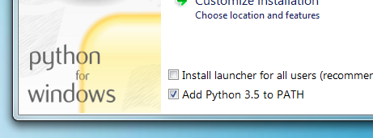

# MkDocs安装

一个详细的指南。

## 要求

MkDocs需要在您的系统上安装最新版本的[Python]和Python 包管理器 [pip]。您可以通过命令行检查是否已经安装了这些软件包：

```console
$ python --version
Python 3.8.2
$ pip --version
pip 20.0.2 from /usr/local/lib/python3.8/site-packages/pip (python 3.8)
```

如果您已经安装了这些软件包，可以跳到[安装MkDocs](#安装mkdocs)。

### 安装Python

使用您选择的软件包管理器安装[Python]，或者从[python.org]下载适合您系统的安装程序并运行它。> 注意：
> 如果您正在Windows上安装Python，请确保勾选将Python添加到PATH的选项（默认情况下未勾选）。>
> 

### 安装pip

如果您正在使用最新版本的Python，则默认情况下已安装Python包管理器[pip]。但是，您可能需要升级pip到最新版本：

```bash
pip install --upgrade pip
```

如果您需要第一次安装pip，请下载[get-pip.py]。然后运行以下命令进行安装：

```bash
python get-pip.py
```

## 安装MkDocs

使用pip安装`mkdocs`包：

```bash
pip install mkdocs
```

现在应该在您的系统上安装了`mkdocs`命令。运行`mkdocs --version`检查是否安装成功。

```console
$ mkdocs --version
mkdocs, version 1.2.0 from /usr/local/lib/python3.8/site-packages/mkdocs (Python 3.8)
```

> 注意：
> 如果您希望为MkDocs安装man页，[click-man]工具可以为您生成和安装它们。只需运行以下两个命令：
>
> ```bash
> pip install click-man
> click-man --target path/to/man/pages mkdocs
> ```
>
> 详细信息请参阅[click-man文档]，了解为什么man页不会自动由pip生成和安装。<!-- - ->
> 注意：
> 如果您正在使用Windows，以上某些命令可能无法直接使用。
> 一个快速的解决方案可能是在每个Python命令前加上 `python -m`，例如：
>
> ```bash
> python -m pip install mkdocs
> python -m mkdocs
> ```
>
> 对于一个更永久的解决方案，您可能需要编辑您的 `PATH` 环境变量，将Python安装的 `Scripts` 目录包含在内。Python的最近版本包括一个脚本来自动完成此操作。进入Python安装目录（例如 `C:\Python38\`），打开 `Tools` 文件夹，然后进入 `Scripts` 文件夹，并双击运行 `win_add2path.py` 文件。或者，您可以下载[脚本][a2p]并运行它（`python win_add2path.py`）。

[Python]: https://www.python.org/
[python.org]: https://www.python.org/downloads/
[pip]: https://pip.readthedocs.io/en/stable/installing/
[get-pip.py]: https://bootstrap.pypa.io/get-pip.py
[click-man]: https://github.com/click-contrib/click-man
[click-man文档]: https://github.com/click-contrib/click-man#automatic-man-page-installation-with-setuptools-and-pip
[a2p]: https://github.com/python/cpython/blob/master/Tools/scripts/win_add2path.py